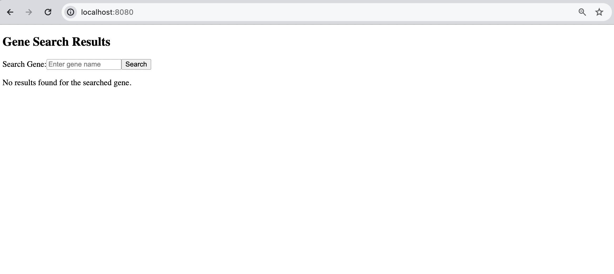
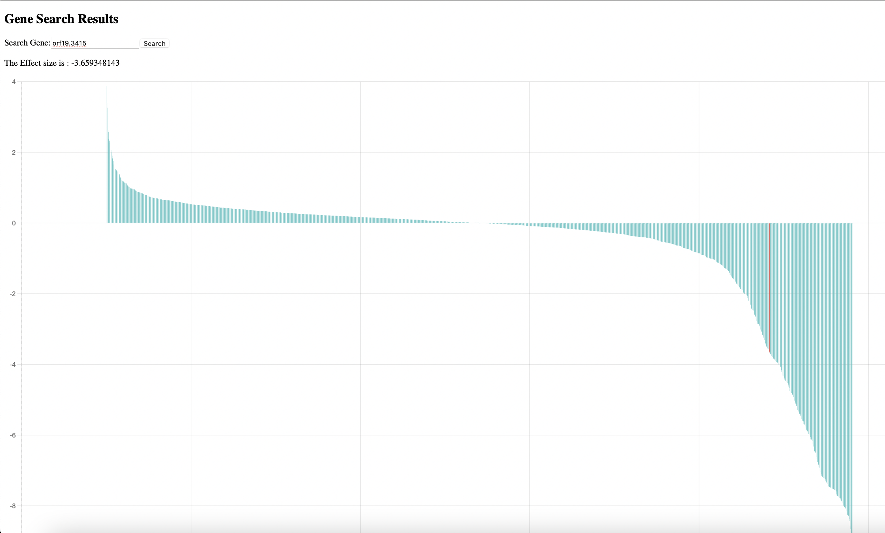

# Myers_lab_gene_site

## Overview

This project consists of a Vue.js frontend for searching and visualizing gene data, with an Express.js backend serving the necessary APIs to interact with the SQLite database.

## Setup

1. **Clone the repository:**

```bash
git clone git@github.com:harshithaanuganti/Myers_lab_gene_site.git
cd gene_site
```

2. **Start servers:**

Backend (Express.js)

```bash
npm start
```

Frontend (Vue.js)
```bash
npm run serve
```

3. **Running the Application**

Access the app at http://localhost:8080 in your web browser.



Enter the gene name in the search box.Click the "Search" button to view the gene's effect size and the distribution histogram.Note that the red line in the histogram indicates where the searched gene's effect size lies in the distribution.




